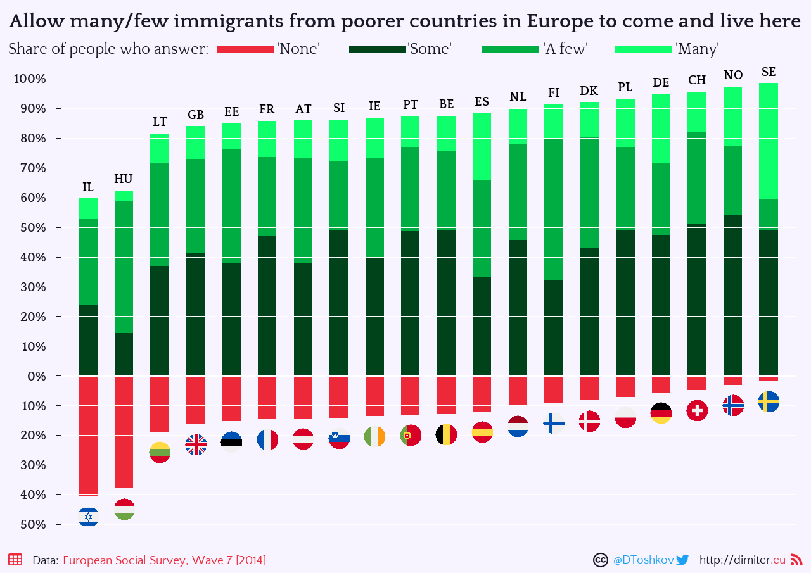
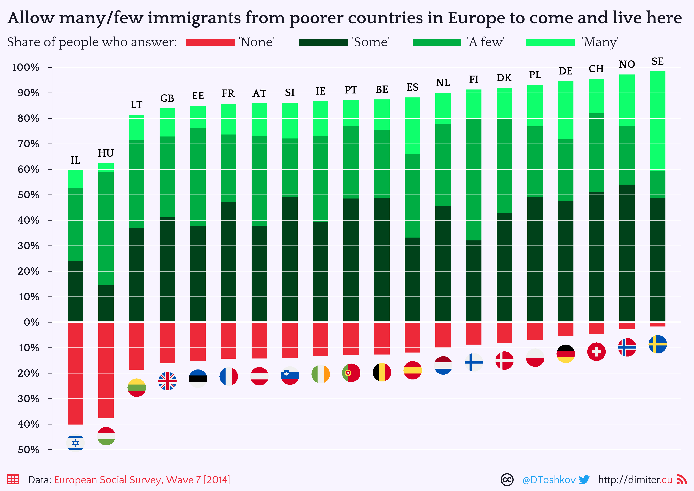
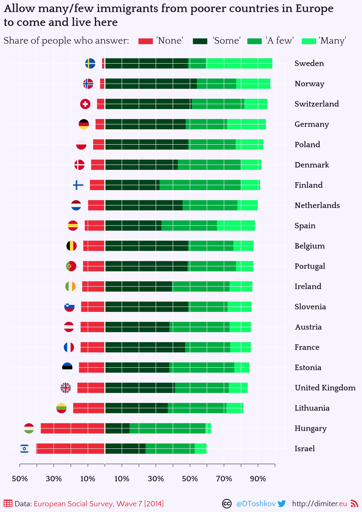

```{r, echo=FALSE, warning=FALSE, message=FALSE}

library(icon)
library(metathis)
meta() %>%
  meta_general(
    robots = "index,follow",
    subject = "Data visualization"
  ) %>%
  meta_description(
    "How to visualize data from the European Social Survey with R"
  ) %>% 
  meta_name("github-repo" = "demetriodor/ESSwithR",
              "keywords" = 'dataviz, ess, European social survey, R, base R, data visualization, survey data, public opinion'
  ) %>% 
  meta_viewport() %>% 
  meta_social(
    title = "Visualizing ESS data with R",
    url = "http://dimiter.eu/Visualizations_files/Visualizing_ESS_data.html",
    #image = "https://r4ds.had.co.nz/cover.png",
    #image_alt = "The cover of the R4DS book",
    og_type = "article",
    og_author = c("Dimiter Toshkov"),
    og_site_name = 'http://dimiter.eu',
    twitter_card_type = "summary",
    twitter_creator = "@DToshkov"
  )
```

<style type="text/css">
div.main-container {
  max-width: 1680px;
  margin-left: auto;
  margin-right: auto;
}

code{
  font-size: 16px;
}

code.r{
  font-size: 14px;
}

pre {
  font-size: 14px
}

</style>


```{r set-options, echo=FALSE, cache=FALSE}
options(width = 1280)
```
&nbsp;

# Introduction
 <font size="3">
 
The [European Social Survey (ESS)](https://www.europeansocialsurvey.org/) is a great source of data on public opinion and attitudes that spans 9 waves (from 2002 till 2018) and covers a large number of European countries. In this tutorial I will explain how you can create effective and appealing visualizations of ESS data with `(base) R`.   
&nbsp;

# Getting the data
There are two ways to read ESS data in `R`. First, you can download the datafile from the [ESS website](https://www.europeansocialsurvey.org/data/) yourself and then read it into `R` using the `haven` [package](https://cran.r-project.org/web/packages/haven/index.html). Alternatively, you can use the `essurvey` [package](https://cran.r-project.org/web/packages/essurvey/index.html) that will import the data directly. In both cases you will need to [register an email](https://www.europeansocialsurvey.org/user/new) in order to access the data. 

Let's use the `essurvey` package to get the ESS Wave 7 (2014) dataset.

```{r eval=TRUE, echo = FALSE, message = FALSE, warning = FALSE, results = FALSE}
library(essurvey) # install from CRAN first
set_email("dtoshkov@fsw.leidenuniv.nl") # set your registered email
```

```{r eval=TRUE, collapse=TRUE, message = FALSE, results = FALSE, class.source = 'fold-show'}
library(essurvey) # install from CRAN first
# set_email("myaccount@email.com") # set your registered email
dat <- import_rounds(7, format = 'spss')
```
&nbsp;

# Working with variables
Once we have read the data into `R`, we can search for variables using the handy `look_for()` function from the `labelled` package. When we find a variable we are interested in, we can quickly inspect it with the `attributes()` function.

The ESS survey provides [weights](https://www.europeansocialsurvey.org/methodology/ess_methodology/data_processing_archiving/weighting.html) - variables that help us to reconstruct statistics (such as averages) for the country populations from which the survey samples have been drawn. We have to use these weights to compute valid statistics for the populations we are interested in. ESS offers two types of weights: design weights and post-stratification weights, which use different methods to reconstruct the population-level stats from the sample data. We can use either of the two, but we **have to** use one.

```{r eval=TRUE, collapse=TRUE, message = FALSE, warning = FALSE}
library(labelled) # install from CRAN first

labelled::look_for(dat, 'poor')
attributes(dat$eimpcnt)
table(dat$eimpcnt)

summary(dat$dweight) # design weights 
summary(dat$pspwght) # post-stratification weights
```
&nbsp;

# Computing weighted statistics
In this tutorial we will focus on the variable `eimpcnt`, which collects responses to the survey question *'Allow many/few immigrants from poorer countries in Europe'* (here is a [screenshot](https://github.com/demetriodor/ESS/blob/master/documentation/q_formulation.png) from the actual questionnaire with the *exact* question formulation). The original answer categories can be checked with the `attributes()$labels` function. We can rename this variable to something more memorable and specify it as an *ordered factor*.

```{r eval=TRUE, collapse=TRUE}
attributes(dat$eimpcnt)$labels
dat$allow.f<-to_factor(dat$eimpcnt, drop_unused_labels=TRUE, ordered=TRUE)
table(dat$allow.f, dat$cntry) # distribution of responses per country (raw)
```
&nbsp;

We want to plot the distribution of the responses to this question by country. To do this, we first need to compute the *weighted* number of responses in each category, for each country. One way to do that is to use the `wtd.table()` function from the `questionr` package. First, we compute the weighted number of responses per country. Then, using `cprop()`we compute the relative proportions of each response category. Finally, we make a data frame from the (transposed) output of these two actions. We add two new variables to this data frame for convenience later, and we order the data frame by the values of one of the columns (the variable with the *'Allow none'* responses).

```{r eval=TRUE, collapse=TRUE, warning=FALSE, message=FALSE}
## One way to get a weighted count per country
library(questionr)
temp.table<-questionr::wtd.table(dat$allow.f, dat$cntry, weights=dat$pspwght, digits = 0, na.show=FALSE)

## Now let's get the relative percentages
temp.cprop.table<-questionr::cprop(temp.table, digits=0, total=FALSE, n=FALSE, percent=TRUE)
temp.cprop.table

## Transpose so that countries are rows, and make it a data frame (unexpectedly, it's not)
## Note that we need to use the special data.frame.matrix() function and not just data.frame()
pt<-as.data.frame.matrix(t(temp.cprop.table)) 
pt<-pt[rownames(pt)!='All',]  # remove the row with the totals if it's included and not needed

## Create new columns for convenience later
pt$afewplus <- pt[ , 'Allow a few'] + pt[, 'Allow many to come and live here']
pt$someplus <- pt[, 'Allow a few'] + pt[ , 'Allow some'] + pt[, 'Allow many to come and live here']

## Order the dataset by the specified column
pt <- pt[order(pt$`Allow none`, decreasing = TRUE),]
```
&nbsp;

# Visualizing the data: first cut
Now that we have the data ready, we are ready to plot! The variable we want to visualize is an ordered categorical one, so some kind of bar graph could be appropriate. However, the response categories imply not only an **order** (from *'none'* to *'some'* to *'a few'* to *'many'*) but also a **threshold** between *'none'* and all else. Moreover, those who answer *'some'* would presumably also accept *'a few'*, and those who answer *'many'* would accept *'a few'* and *'some'* immigrants. It will be nice if our visualization indicates both the ordered nature of the categories, as well as the threshold and the fact that some categories are subsumed in others.
&nbsp;

We can use a variation of the stacked bar graph to visualize our variable. The positioning of the bars and their colors will help communicate the ordered nature of the variable and the threshold. Instead of aligning all bars to the bottom (or to the left), we move the zero line inside the graph, and we let the *'Allow none'* responses go down and all others go up from the zero line. We give the *'Allow none'* and all other responses contrasting colors. And we vary the brightness (but keep the same base color) of the three 'positive' responses, with *'Allow many'* being the lightest and *'Allow some'* being the darkest. We can use red and green colors for the bars to utilize people's intuitive associations of red with prohibition and green with access. (Note that this color combination might be challenging for people with  color blindness.)
&nbsp;

This sort of **diverging stacked bar chart** is common for Likert-scale responses to survey data. There are specialized packages that will produce this type of graph directly ([see](https://rpubs.com/tskam/likert) the `likert` function from the `HH` package or the `likert` [package](https://cran.r-project.org/web/packages/likert/likert.pdf) or a hack with [ggplot2](https://stackoverflow.com/questions/49161918/plot-divergent-stacked-bar-chart-with-ggplot2)). However, we are going to use `base R` plotting, because it allows us the most flexibility in tweaking all the features of the graph. 
&nbsp;

Before we get plotting, you should know that people have [argued](https://blog.datawrapper.de/divergingbars/) against the use of diverging stacked bar charts, but not everyone is convinced (see [here](https://www.linkedin.com/pulse/diverging-100-stacked-bars-useless-daniel-zvinca/)). I personally find this type of graph both visually appealing and informative as it communicates categorical differences between groups of responses as well as subtler differences within groups. 
&nbsp;

The plot below is our first, quick-and-dirty attempt to make a diverging stacked bar chart. We start with an empty plot that only specifies the range of the x- and y-axes. Then we iterate using a `loop` over the rows of the data to plot a rectangle for the share of each category. Finally, we add indicators for the countries by reference to the names of the rows of the data.  

```{r eval=TRUE, collapse=TRUE, fig.dim = c(12, 9)}
plot(NULL, # start with an empty plot
     xlim=c(1, dim(pt)[1]), # the x axis should extend from 1 to the nubmer of rows in the data
     ylim=c(-max(pt[, 'Allow none']), max(pt$someplus))) # the y axis should extend from the negative of the maximum of the 'Allow none' category to the maximum of the sum of the other three categories 

for (i in 1:dim(pt)[1]){ # for each row in the data
  rect(xleft = i - 0.25, xright = i + 0.25, ybottom = 0 - pt[i , 'Allow none'], ytop =  0, col='red') # plot a red rectangle going down from zero for the 'Allow none' category
  rect(xleft = i - 0.25, xright = i + 0.25, ybottom = 0, ytop =  0 + pt$someplus[i], col='lightgreen') # plot green rectangles going up for the rest of the categories 
  rect(xleft = i - 0.25, xright = i + 0.25, ybottom = 0, ytop =  0 + pt[i , 'Allow a few'] + pt[i , 'Allow some'], col='green') 
  rect(xleft = i - 0.25, xright = i + 0.25, ybottom = 0, ytop =  0 + pt[i , 'Allow some'], col='darkgreen') 

  text (rownames(pt)[i], x = i, y = 0 + pt$someplus[i] + 4) # add the names of the countries above each set of bars
}
```

There is a lot that can be improved about this plot, but overall it shows the data in the way we intended.
&nbsp;


# Improving the visualization
To improve on this draft plot, we can (1) specify a better color palette, (2) add proper annotation, including an informative title, axes labels, country labels, gridlines and a legend, (3) customize the fonts, (4) and add a statement about the data source and the author.  
&nbsp;

## Color palette
In the draft plot we used the named red and greens that are available in `base R`. But we can specify our own colors to be used, either by relying on one of the many R packages for color palettes or by specifying the colors directly with their `rgb` values. To pick a good  combination of colors we can use one of the many color picker tools available online, for example [Color Code](http://colorcode.is/). Let's pick the eye-pleasing [Pantone Red](http://red-pantone.colorcode.is/) matched with a [Pantone Green](http://green-pantone.colorcode.is/). Then we can define lighter and darker versions of the Pantone Green.

While the default background of the plots in `base R` is pure white and the color for annotations is pure black, designers recommend against using pure whites and blacks. Therefore, we define a custom background color that is *almost* white with a slight tint of magnolia and a custom dark color that is a touch lighter than solid black.

```{r eval=TRUE, collapse=TRUE}
## color settings
background.color = rgb(248, 244, 255, max=255) # color for the background: magnolia
dark.color = rgb(24, 24, 38, max=255) # dark color: almost black

red.1 = rgb(237, 41, 57, max=255) # default red (Pantone)
green.1 = rgb(0, 173, 67, max=255) # default green (Pantone)
green.dark = rgb(0, 66, 26, max=255) # dark green
green.light = rgb(15, 255, 108, max=255) # light green

blue.twitter = rgb (29, 161, 242, max=255) # twitter blue
```
&nbsp;

## Annotation
Proper annotation that is informative but not obtrusive is key for effective data visualization. So we have to think carefully about the axes, titles, gridlines, legends and other elements that help the user decode the plot. 
&nbsp;

### Axes
Let's start with the axes. The horizontal axis is not really necessary: we can add the country indicators directly below or above the bars. The vertical axis is definitely necessary. To specify its range, we can pick nice round numbers that are just below and just above the extreme values in our data. (Of course we can rely on the plotting defaults, but these would not always work well, so it is good to know how to specify our own values). The `round_any()` function from the `plyr` package rounds to a multiple of any number by specifying `accuracy` and `f` (function: floor, ceiling or round). We use it to get the nearest multiple of 10 that is greater than the maximum values observed in the respective variables in our data.

```{r eval=TRUE, collapse=TRUE}
## axes range settings
library(plyr)
y.min <- plyr::round_any(max(pt[, 'Allow none']), accuracy = 10, f = ceiling)
y.max <- plyr::round_any(max(pt$someplus), accuracy = 10, f = ceiling)
```
&nbsp;

To add the custom vertical axis, first we turn off the automatic inclusion of axes and other annotation from the `par()` setting (`ann=FALSE`) and when we call `plot()` with `yaxt = "n"` and `xaxt = "n"`. While we are at it, we should also turn off the automatic drawing of a box around the plot by setting the `bty='n'` argument of `par()`. Then we can describe the axis directly with the `axis()` function with our own labels, colors and other custom settings.

```{r eval=FALSE, collapse=TRUE}
## specify vertical axis
axis (2, # this indicates which axis to draw: 1 is bottom and it goes clockwise from there, so 2 is left
      line = 0, # position in terms of the plotting region
      lwd = 1, # width of axis lines
      tck = -0.01, # length of axis tick marks
      col = dark.color, # color of the actual axis (line) 
      col.axis = dark.color, # colors of the actual labels
      cex.axis = 1, # font size of of the axis lables
      font=2, # font type (bold)
      at=seq(-y.min, y.max, 10), # where to put the labels  
      labels= paste0(c(rev(seq(0, y.min, 10)), seq(10, y.max,10)), "%"), # text of labels 
      las=1 # orientation of the labels
)

```
&nbsp;

### Gridlines
To include custom gridlines, we just add horizontal and vertical lines where we want the gridlines to be. Since our background is not pure white anymore, we can actually define the gridlines themselves to be white, which makes them just visible but unobtrusive. To put emphasis on the line at zero, we can make it slightly wider than the rest. There are two tricks to adding the gridlines: first, we have to think about *when* to add them, so that they are not drawn on top of labels and other annotation but are drawn on top of the rectangles themselves; second; we have to set the `xpd` setting in `par()` to `FALSE`, so that the gridlines do not extend outside the figure region.

```{r eval=FALSE, collapse=TRUE}
abline(h=seq(-50,100,10), col='white', lwd=1)
abline(h=0, col='white', lwd=3)
```
&nbsp;

### Titles
I prefer to add titles, subtitles, axes names and legends with `mtext()`. This gives more control where exactly to position these annotation elements, including in the margins area that is outside the figure region ([this](https://www.r-graph-gallery.com/74-margin-and-oma-cheatsheet.html) is a good explanation of the different plotting and margins areas of figures in base R). Using `mtext()` in combination with `expression()` also makes it possible to have text with different colors and formatting on the same line. 

```{r eval=FALSE, collapse=TRUE}
# title
offset = 0.01 # distance from the corners of the plotting area
mtext.title = 2 # scaling factor for the font size

mtext(expression(bold('Allow many/few immigrants from poorer countries in Europe to come and live here')), # the text
      side = 3, # on which side of the plot to include; 3 is top
      line = 2, # position of the text in terms of the figure region; 2 is two lines above the top of the figure
      adj = 0, # horizontal adjustment of the text; 0 is left
      padj = 1, # vertical adjustment of the text; 1 is top
      outer = TRUE, # whether the plot in the margins (outside the figure region)
      at = offset, # offset position from the corners of the plotting area
      font=1,  # font type
      col=dark.color,  # font color
      cex = mtext.title # font size
      )
```
&nbsp;

We have to make sure to leave enough space in the margins of the figure for titles and subtitles by specifying the `oma` and `mar` settings of `par()` before we call the plot.
&nbsp;

### Legend
To include a custom legend on top of the figure, we can also you `mtext()`. First we only plot the text of the legend labels. Then we add the different symbols (rectangles) with their respective colors. Admittedly, this requires quite a bit of tweaking to get the rectangles fall exactly where needed. But it is still better than having no legend at all or putting the legend within the figure region where it often obscures the actual data.

```{r eval=FALSE, collapse=TRUE}
mtext.subtitle = 1.5 # scaling factor for the size of the font
mtext(expression(italic("Share of people who answer:                   'None'                       'Some'                       'A few'                       'Many'")),
      side = 3, line = 0, adj = 0, padj = 1, outer = TRUE, at = offset, 
      font=1, col=dark.color, cex = mtext.subtitle)

par(xpd = TRUE) # turn on plotting outside the figure region
points(x = 5.4, y = 118, pch = 15, cex = 10, col=red.1) # add small rectangles with the respective color
points(x = 5.4 + 3.7, y = 118, pch = 15, cex = 10, col=green.dark)
points(x = 5.4 + 2*3.7, y = 118, pch = 15, cex = 10, col=green.1)
points(x = 5.4 + 3*3.7, y = 118, pch = 15, cex = 10, col=green.light)
```
&nbsp;

Let's see where we got so far:
```{r eval=TRUE, collapse=TRUE, fig.dim = c(12.8, 9.055), dpi=300}
y.min <- plyr::round_any(max(pt[, 'Allow none']), accuracy = 10, f = ceiling)
y.max <- plyr::round_any(max(pt$someplus), accuracy = 10, f = ceiling)
offset = 0.01
mtext.title = 1.8
mtext.subtitle = 1.5

par(mfrow=c(1,1), # number and distribution of plots
    oma=c(1,0,3,0), # size of the outer margins in lines of text (can be specified in inches as well with `omi`)
    mar=c(1,4,1,1), # number of lines of margin to be specified on the four sides of the plot (can be specified in inches as well with `mai`) 
    bty='n', # no box
    cex = 1.25, # magnification of text and symbols
    xpd = FALSE, # clipping of plotting to the figure region
    ann = FALSE, # switch off titles,
    #yaxt = 'n', # switch off y axis, do not do this here, it cannot be overriden with axis() 
    #xaxt = 'n', # switch off x axis
    bg=background.color # background color
)

plot(NULL, xlim=c(1, dim(pt)[1]), ylim=c(-y.min, y.max), yaxt = 'n', xaxt = 'n')  # the empty plot

axis (2, 
      line = 0, # position
      tck = -0.01, 
      col = dark.color, # the actual axis (line) 
      col.axis = dark.color, # colors of the actual labels
      cex.axis = 1, 
      font=2, # font type (bold)
      at=seq(-y.min, y.max, 10), # where to put labels  
      labels= paste0(c(rev(seq(0, y.min, 10)), seq(10, y.max,10)), "%"), # text of labels 
      las=1 # orientation of the labels
)

for (i in 1:dim(pt)[1]){
  rect(xleft = i - 0.25, xright = i + 0.25, ybottom = 0 - pt[i , 'Allow none'], ytop =  0, col=red.1, border=red.1)
  rect(xleft = i - 0.25, xright = i + 0.25, ybottom = 0, ytop =  0 + pt$someplus[i], col=green.light, border=green.light)   
  rect(xleft = i - 0.25, xright = i + 0.25, ybottom = 0, ytop =  0 + pt[i , 'Allow a few'] + pt[i , 'Allow some'], col=green.1, border=green.1) 
  rect(xleft = i - 0.25, xright = i + 0.25, ybottom = 0, ytop =  0 + pt[i , 'Allow some'], col=green.dark, border=green.dark) 
}  
abline(h=seq(-50,100,10), col='white', lwd=1)
abline(h=0, col='white', lwd=3)

# do that now so it is not crossed by the gridlines
for (i in 1:dim(pt)[1]){
  text (rownames(pt)[i], x = i, y = 0 + pt$someplus[i] + 4, font=2)
}  

#title
mtext(expression(bold('Allow many/few immigrants from poorer countries in Europe to come and live here')),
      side = 3, line = 2, adj = 0, padj = 1, outer = TRUE, at = offset,
      font=1, col=dark.color, cex = mtext.title)
mtext(expression(italic("Share of people who answer:                'None'                   'Some'                    'A few'                   'Many'")),
      side = 3, line = 0, adj = 0, padj = 1, outer = TRUE, at = offset, 
      font=1, col=dark.color, cex = mtext.subtitle)

par(xpd = TRUE)
points(x = 5.4, y = 118, pch = 15, cex = 10, col=red.1)
points(x = 5.4 + 3.7, y = 118, pch = 15, cex = 10, col=green.dark)
points(x = 5.4 + 2*3.7, y = 118, pch = 15, cex = 10, col=green.1)
points(x = 5.4 + 3*3.7, y = 118, pch = 15, cex = 10, col=green.light)
```
&nbsp;

### Data, copyright and author tags
The result looks much better. But we can improve it further with some additional tweaks. For example, it is good practice to point to the source of the data that we visualize. Also, it is not a bad idea to sign your work, so that people know how to reach you and follow your work. We can use `mtext()` to put statements about the data and the author at the bottom of the graphs (again, we have to make sure there is enough space in the margins).

In the code below you can see how to use a little trick to include text with different colors on the same line: this involves encircling your text in an `expression()` and then using `phantom()` to suppress printing different parts of the texts everytime you call it. 

```{r eval=FALSE, collapse=TRUE}
mtext.sign = 1.2

#data statement
mtext(text=expression("Data: " * phantom("European Social Survey, Wave 7 [2014]")), 
      side=1, line=-1, outer=T, at = offset + 0.03, col=dark.color, cex=mtext.sign, font=1, adj=0, padj=1)
mtext(text=expression(phantom("Data: ") * "European Social Survey, Wave 7 [2014]"), 
      side=1, line=-1, outer=T, at = offset + 0.03, col=red.1, cex=mtext.sign, font=1, adj=0, padj=1)

#signature
mtext(text=expression(phantom("@DToshkov  ") * " http://dimiter" * phantom(".eu")), 
      side=1, line=-1, outer=T, at = 1 - offset - 0.02, col=dark.color, cex=mtext.sign, font=1, adj=1, padj=1)

mtext(text=expression(phantom("@DToshkov   http://dimiter") * ".eu"),
      side=1, line=-1, outer=T, at = 1 - offset - 0.02, col=red.1, cex=mtext.sign, font=1, adj=1, padj=1)

mtext(text=expression("@DToshkov  " * phantom(" http://dimiter.eu")), 
      side=1, line=-1, outer=T, at = 1 - offset - 0.02, col=blue.twitter, cex=mtext.sign,font=1, adj=1, padj=1)
```
&nbsp;

## Custom fonts and icons 
One way to improve the styling of your plots is to ditch the default fonts in R and use a custom set of fonts. The way I do this relies on the [`extrafont`](https://CRAN.R-project.org/package=extrafont ), [`sysfont`](https://CRAN.R-project.org/package=sysfonts) and [`showtext`](https://cran.rstudio.com/web/packages/showtext/vignettes/introduction.html) packages. This allows us to select a set of fonts from [Google Fonts](https://fonts.google.com/), for example, install them on our system with `font_add_google()` and then use them by calling `showtext_auto()` before the code for the plot and specifying the name of the font we want in `par()` and/or directly in `mtext()`. 

```{r eval=FALSE, collapse=TRUE}
library(extrafont) # to embed extra fonts
library(sysfonts) # to check available fonts and download fonts from google
library(showtext) # to use the extra fonts

font_add_google('Quattrocento') #get the fonts 
font_add_google('Quattrocento Sans')
font_families() #check that the fonts are installed and available

showtext_auto() #this is to turn on the custom fonts availability
showtext_opts(dpi = 96) #set the resolution: 96 is default
```
&nbsp;

Taking styling one step further, we can also incorporate emojis and icons in our annotations with the `emojifont` [package](https://cran.r-project.org/web/packages/emojifont/vignettes/emojifont.html). For example, we can include the twitter logo in the footer of our plot with the following code:

```{r eval=FALSE, collapse=TRUE}
library(emojifont)
mtext.sign.emo = 1.5
mtext(text= fontawesome('fa-twitter'), # the icon or emoji we want
      side=1, line=-1, outer=T, col=blue.twitter, cex=mtext.sign.emo, at = 1 - 0.23, adj=1, padj=0.8,
      font=1, family='fontawesome-webfont') # the Font Awesome font
```
&nbsp;

We can also add the 'Creative Commons' sign to indicate the conditions of use of our visualization. Unfortunately, the `showtext` package does not work with RStudio and [RMarkdown](https://github.com/rstudio/rmarkdown/issues/1460), so the custom fonts and emojis will not be visible when you plot directly from RStudio or when you compile a `.Rmd` document. But the custom fonts and emojis **will** be visible when you save your plots directly as `png` or `pdf` files (see below).


```{r eval=TRUE, echo=FALSE, results=FALSE, message=FALSE, warning=FALSE}
library(emojifont)
library(extrafont) # to embed extra fonts
library(sysfonts) # to check available fonts and download fonts from google
library(showtext) # to use the extra fonts
font_add_google('Quattrocento') #get the fonts 
font_add_google('Quattrocento Sans')
font_families() #check that the fonts are installed and available
showtext_auto() #this is to turn on the custom fonts availability
mtext.sign = 1.2
mtext.sign.emo = 1.5
```
&nbsp;

## Adding country flags
While our plot already features the country codes above the bars, not everyone will be very familiar with these. So we can help the reader by including further information about the countries. Adding the full country names takes too much space, but we can include country flags as additional reference symbols. To do so, we can do the following. First, we download the free library of country flags from [FlatIcon](https://www.flaticon.com/packs/countrys-flags). The licence provides for free use if we give the following attribution: *"Icon made by Freepik from www.flaticon.com"*. Once the flags are downloaded, we can access and read them as `png`-s, and place in the plots.  

```{r eval=TRUE, collapse=TRUE}
library(png)
temp.flag <- png::readPNG('./flags/197373-countrys-flags/png/albania.png')
dim(temp.flag)
```
&nbsp;

We can place a `png` image on a plot after we draw from it a raster image, e.g. with `rasterImage(temp.flag, 1,1,10,71.5)`. However, it is much more convenient to use the custom `addImg()` function written by *'Marc in a box'* that only requires that we point to the center of the x- and y- coordinates of the image rather than to the four corners.

```{r eval=TRUE, collapse=TRUE}
## Function to place images by center points on the two axes rather than corners by Stack Overflow user 'Marc in the box', retrieved from: https://stackoverflow.com/questions/27800307/adding-a-picture-to-plot-in-r
addImg <- function(
  obj, # an image file imported as an array (e.g. png::readPNG, jpeg::readJPEG)
  x = NULL, # mid x coordinate for image
  y = NULL, # mid y coordinate for image
  width = NULL, # width of image (in x coordinate units)
  interpolate = TRUE # (passed to graphics::rasterImage) A logical vector (or scalar) indicating whether to apply linear interpolation to the image when drawing. 
){
  if(is.null(x) | is.null(y) | is.null(width)){stop("Must provide args 'x', 'y', and 'width'")}
  USR <- par()$usr # A vector of the form c(x1, x2, y1, y2) giving the extremes of the user coordinates of the plotting region
  PIN <- par()$pin # The current plot dimensions, (width, height), in inches
  DIM <- dim(obj) # number of x-y pixels for the image
  ARp <- DIM[1]/DIM[2] # pixel aspect ratio (y/x)
  WIDi <- width/(USR[2]-USR[1])*PIN[1] # convert width units to inches
  HEIi <- WIDi * ARp # height in inches
  HEIu <- HEIi/PIN[2]*(USR[4]-USR[3]) # height in units
  rasterImage(image = obj, 
              xleft = x-(width/2), xright = x+(width/2),
              ybottom = y-(HEIu/2), ytop = y+(HEIu/2), 
              interpolate = interpolate)
}

```
&nbsp;

How do we call each individual png file with the country flag that we need? When we downloaded the country flags, the names of the files correspond to the full names of the countries. In our ESS data, the names of the countries are in two character ISO codes. To switch between full names and ISO codes, the `countrycode` package comes to the rescue. So in the code below we reconstruct the paths and names of the files where the country flags are from their ISO codes contained in the ESS datafile:

```{r eval=FALSE, collapse=TRUE}
addImg( # add the image
  readPNG( # read the image as png
    paste0('./flags/197373-countrys-flags/png/', # point to the address where the image of the flag is: first, address of the folder
           gsub(" ","-", # replace intervals with hyphens
                tolower( # make everything lower case
                  countrycode(rownames(pt)[1],  # convert the country indicator
                                    origin = 'iso2c', # from 2-character ISO code
                                    destination = 'country.name'))), # to full name
           '.png')), # complete the file name
         x = 1, y =  0 - pt[1 , 'Allow none'] - 7, # point to where the image should be placed 
  width = 0.6 # scale the size of the image
  ) 
```
&nbsp;

Let's check how this worked:
```{r eval=FALSE, collapse=TRUE}
library(countrycode)

par(mfrow=c(1,1), # number and distribution of plots
    oma=c(1,0,3,0), # size of the outer margins in lines of text 
    mar=c(1,4,1,1), # number of lines of margin to be specified on the four sides of the plot 
    bty='n', # no box
    cex = 1.25, # magnification of text and symbols
    xpd = FALSE, # clipping of plotting to the figure region
    ann = FALSE, # switch off titles,
    bg=background.color, # background color
    family='Quattrocento' # font family
    )

plot(NULL, xlim=c(1, dim(pt)[1]), ylim=c(-y.min, y.max), yaxt = 'n', xaxt = 'n') 

axis (2, 
      line = 0, # position
      tck = -0.01, 
      col = dark.color, # the actual axis (line) 
      col.axis = dark.color, # colors of the actual labels
      cex.axis = 1, 
      font=2, # font type (bold)
      at=seq(-y.min, y.max, 10), # where to put labels  
      labels= paste0(c(rev(seq(0, y.min, 10)), seq(10, y.max,10)), "%"), # text of labels 
      las=1 # orientation of the labels
      )

for (i in 1:dim(pt)[1]){
  rect(xleft = i - 0.25, xright = i + 0.25, ybottom = 0 - pt[i , 'Allow none'], ytop =  0, col=red.1, border=red.1)
  rect(xleft = i - 0.25, xright = i + 0.25, ybottom = 0, ytop =  0 + pt$someplus[i], col=green.light, border=green.light)   
  rect(xleft = i - 0.25, xright = i + 0.25, ybottom = 0, ytop =  0 + pt[i , 'Allow a few'] + pt[i , 'Allow some'], col=green.1, border=green.1) 
  rect(xleft = i - 0.25, xright = i + 0.25, ybottom = 0, ytop =  0 + pt[i , 'Allow some'], col=green.dark, border=green.dark) 
}  

abline(h=seq(-50,100,10), col='white', lwd=1)
abline(h=0, col='white', lwd=3)

# do that now so it is not crossed by the gridlines
for (i in 1:dim(pt)[1]){
  text (rownames(pt)[i], x = i, y = 0 + pt$someplus[i] + 4, font=2)
  
  addImg(readPNG(paste0('./flags/197373-countrys-flags/png/', 
                        gsub(" ","-", tolower(countrycode(rownames(pt)[i], origin = 'iso2c', destination = 'country.name'))), 
                        '.png')), 
         x = i, y =  0 - pt[i , 'Allow none'] - 7, width = 0.6)
  }  

#title
mtext(expression(bold('Allow many/few immigrants from poorer countries in Europe to come and live here')),
      side = 3, line = 2, adj = 0, padj = 1, outer = TRUE, at = offset, font=1, col=dark.color, cex = mtext.title)

#legend
mtext(expression(italic("Share of people who answer:                'None'                   'Some'                    'A few'                   'Many'")),
      side = 3, line = 0, adj = 0, padj = 1, outer = TRUE, at = offset, font=1, col=dark.color, cex = mtext.subtitle)

par(xpd = TRUE)
points(x = 5.4, y = 118, pch = 15, cex = 10, col=red.1)
points(x = 5.4 + 3.7, y = 118, pch = 15, cex = 10, col=green.dark)
points(x = 5.4 + 2*3.7, y = 118, pch = 15, cex = 10, col=green.1)
points(x = 5.4 + 3*3.7, y = 118, pch = 15, cex = 10, col=green.light)

#data statement
mtext(text = fontawesome('fa-table'), side=1, line=-1, outer=T, adj=0, padj=0.8,
      col=red.1, cex=mtext.sign.emo, at = offset, font=1, family='fontawesome-webfont')

mtext(text=expression("Data: " * phantom("European Social Survey, Wave 7 [2014]")), 
      side=1, line=-1, outer=T, at = offset + 0.03,
      col=dark.color, cex=mtext.sign, font=1, family='Quattrocento Sans', adj=0, padj=1)

mtext(text=expression(phantom("Data: ") * "European Social Survey, Wave 7 [2014]"), 
      side=1, line=-1, outer=T, at = offset + 0.03, col=red.1, cex=mtext.sign, font=1, family='Quattrocento Sans', adj=0, padj=1)

#signature
mtext(text=expression(phantom("@DToshkov  ") * " http://dimiter" * phantom(".eu")), 
      side=1, line=-1, outer=T, at = 1 - offset - 0.02, col=dark.color, cex=mtext.sign, font=1, family='Quattrocento Sans', adj=1, padj=1)

mtext(text=expression(phantom("@DToshkov   http://dimiter") * ".eu"),
      side=1, line=-1, outer=T, at = 1 - offset - 0.02, col=red.1, cex=mtext.sign,font=1, family='Quattrocento Sans', adj=1, padj=1)

mtext(text=expression("@DToshkov  " * phantom(" http://dimiter.eu")), 
      side=1, line=-1, outer=T, at = 1 - offset - 0.02, col=blue.twitter, cex=mtext.sign,font=1, family='Quattrocento Sans', adj=1, padj=1)

mtext(text= fontawesome('fa-twitter'), 
      side=1, line=-1, outer=T, adj=1, padj=0.8, col=blue.twitter, cex=mtext.sign.emo, at = 1 - 0.23, font=1, family='fontawesome-webfont')

mtext(text= fontawesome('fa-creative-commons'), 
      side=1, line=-1, outer=T, col=dark.color, cex=mtext.sign.emo, at = 1 - 0.33, font=1, family='fontawesome-webfont', adj=1, padj=0.8)

mtext(text= fontawesome('fa-rss'), 
      side=1, line=-1, outer=T, adj=1, padj=0.8, col=red.1, cex=mtext.sign.emo, at = 1 - offset, font=1, family='fontawesome-webfont')
```



&nbsp;

Pretty, pretty good, as [Larry David](https://www.youtube.com/watch?v=kRz8-EXlhBo) would put it.
&nbsp;

# Saving the visualization
Now that we have an informative, properly annotated, visually appealing data visualization, we would want to save it. We can save in multiple formats, but usually `png` or `pdf` (or both) are sufficient. In principle, saving a plot as a `png` file is as easy as calling `png('filename.png')` before we run the code for the plot and `dev.off()` after. But we have to make sure that the plot looks sharp. 
&nbsp;

## Saving a small-sized png
When we save as a `png`, we can specify the width and height of the output file, as well as the desired resolution. If we prepare the file for a desktop computer or a laptop, a width of 1280 pixels is a reasonable default. The height can be set to  906 pixels (to approximate the dimensions of a standard A4 page) and the resolution to the standard for web images 96 ppi. (The plot above was produced with these specifications).

```{r eval=FALSE, collapse=TRUE}
png ('./figures/F1_small.png', width=1280, height=906, res=96)
### code for plot comes here
dev.off()
```
&nbsp;

## Saving a large-sized png
However, the resulting plot does not look that sharp even on my relatively small laptop. Changing the resolution (say to 300) while keeping the width and height the same would achieve nothing (try it!). We can improve the sharpness of the image by enlarging the dimensions of the `png` while keeping the same resolution. But we will have to increase the size of most elements of the plot as well, so they will still look big enough. As you can see from the code below, we increase the width and height of the plot, as well as the font sizes and line thickness, three times. The result looks much sharper (here is a link to the [full-size image](https://github.com/demetriodor/ESS/blob/master/figures/F1_big.png); look at it at 100% magnification), which comes at the price of a larger file size (which, however, at 285 KB should not be a point of concern). Note that some small tweaks might need to be made to legends and other annotations to ensure that everything still falls in its right place. 
&nbsp;

```{r class.source = NULL, eval=FALSE, collapse=TRUE}
s = 3 # scaling factor
mtext.title = 2*s
mtext.subtitle = 1.5*s
mtext.sign = 1.2*s
mtext.sign.emo = 1.5*s

showtext_opts(dpi = 96) #set the resolution: 96 is default

png ('./figures/F1_big.png', width=1280*s, height=905.5*s, res=96)

par(mfrow=c(1,1), # number and distribution of plots
    oma=c(1,0,3,0), # size of the outer margins in lines of text
    mar=c(1,4,1,1), # number of lines of margin to be specified on the four sides of the plot 
    bty='n', # no box
    cex = 1.25*s, # magnification of text and symbols
    xpd = FALSE, # clipping of plotting to the figure region
    ann = FALSE, # switch off titles,
    bg=background.color, # background color
    family='Quattrocento' # font family
    )

plot(NULL, xlim=c(1, dim(pt)[1]), ylim=c(-y.min, y.max), yaxt = 'n', xaxt = 'n') 

axis (2, 
      line = 0, # position
      tck = -0.01,
      lwd = 1*s,
      col = dark.color, # the actual axis (line) 
      col.axis = dark.color, # colors of the actual labels
      cex.axis = 1, 
      font=2, # font type (bold)
      at=seq(-y.min, y.max, 10), # where to put labels  
      labels= paste0(c(rev(seq(0, y.min, 10)), seq(10, y.max,10)), "%"), # text of labels 
      las=1 # orientation of the labels
      )

for (i in 1:dim(pt)[1]){
  rect(xleft = i - 0.25, xright = i + 0.25, ybottom = 0 - pt[i , 'Allow none'], ytop =  0, col=red.1, border=red.1)
  rect(xleft = i - 0.25, xright = i + 0.25, ybottom = 0, ytop =  0 + pt$someplus[i], col=green.light, border=green.light)   
  rect(xleft = i - 0.25, xright = i + 0.25, ybottom = 0, ytop =  0 + pt[i , 'Allow a few'] + pt[i , 'Allow some'], col=green.1, border=green.1) 
  rect(xleft = i - 0.25, xright = i + 0.25, ybottom = 0, ytop =  0 + pt[i , 'Allow some'], col=green.dark, border=green.dark) 
  }  


abline(h=seq(-50,100,10), col='white', lwd=1*s)
abline(h=0, col='white', lwd=3*s)

for (i in 1:dim(pt)[1]){
  text (rownames(pt)[i], x = i, y = 0 + pt$someplus[i] + 4, font=2)
  
  addImg(readPNG(paste0('./flags/197373-countrys-flags/png/', gsub(" ","-", tolower(countrycode(rownames(pt)[i], origin = 'iso2c', destination = 'country.name'))), '.png')), 
         x = i, y =  0 - pt[i , 'Allow none'] - 7, width = 0.6)
  }  

#title
mtext(expression(bold('Allow many/few immigrants from poorer countries in Europe to come and live here')),
      side = 3, line = 2, adj = 0, padj = 1, outer = TRUE, at = offset, font=1, col=dark.color, cex = mtext.title)

#legend
mtext(expression(italic("Share of people who answer:                    'None'                         'Some'                         'A few'                         'Many'")),
      side = 3, line = 0, adj = 0, padj = 1, outer = TRUE, at = offset, font=1, col=dark.color, cex = mtext.subtitle)

par(xpd = TRUE)
points(x = 5.4, y = 118, pch = 15, cex = 10, col=red.1)
points(x = 5.4 + 3.7, y = 118, pch = 15, cex = 10, col=green.dark)
points(x = 5.4 + 2*3.7, y = 118, pch = 15, cex = 10, col=green.1)
points(x = 5.4 + 3*3.7, y = 118, pch = 15, cex = 10, col=green.light)

#data statement
mtext(text = fontawesome('fa-table'), 
      side=1, line=-1, outer=T, col=red.1, cex=mtext.sign.emo, at = offset, font=1, family='fontawesome-webfont', adj=0, padj=0.8)

mtext(text=expression("Data: " * phantom("European Social Survey, Wave 7 [2014]")), 
      side=1, line=-1, outer=T, at = offset + 0.03, col=dark.color, cex=mtext.sign, font=1, family='Quattrocento Sans', adj=0, padj=1)

mtext(text=expression(phantom("Data: ") * "European Social Survey, Wave 7 [2014]"), 
      side=1, line=-1, outer=T, at = offset + 0.03, col=red.1, cex=mtext.sign, font=1, family='Quattrocento Sans', adj=0, padj=1)

#signature
mtext(text=expression(phantom("@DToshkov        ") * " http://dimiter" * phantom(".eu")), 
      side=1, line=-1, outer=T, at = 1 - offset - 0.02, col=dark.color, cex=mtext.sign, font=1, family='Quattrocento Sans', adj=1, padj=1)

mtext(text=expression(phantom("@DToshkov         http://dimiter") * ".eu"),
      side=1, line=-1, outer=T, at = 1 - offset - 0.02, col=red.1, cex=mtext.sign, font=1, family='Quattrocento Sans', adj=1, padj=1)

mtext(text=expression("@DToshkov        " * phantom(" http://dimiter.eu")), 
      side=1, line=-1, outer=T, at = 1 - offset - 0.02, col=blue.twitter, cex=mtext.sign, font=1, family='Quattrocento Sans', adj=1, padj=1)

mtext(text= fontawesome('fa-creative-commons'), 
      side=1, line=-1, outer=T, col=dark.color, cex=mtext.sign.emo, at = 1 - 0.26, font=1, family='fontawesome-webfont', adj=1, padj=0.8)

mtext(text= fontawesome('fa-twitter'), 
      side=1, line=-1, outer=T, col=blue.twitter, cex=mtext.sign.emo, at = 1 - 0.15,font=1, family='fontawesome-webfont', adj=1, padj=0.8)

mtext(text= fontawesome('fa-rss'), 
      side=1, line=-1, outer=T, col=red.1, cex=mtext.sign.emo, at = 1 - offset, font=1, family='fontawesome-webfont', adj=1, padj=0.8)

dev.off()
```



&nbsp;

## Saving a pdf
If we want to save a `pdf`, we have to call the `pdf()` function instead of `png()` (and specify a `.pdf` extension of the output file). When we save a pdf we specify the size of the desired output file in inches; for example, to make an A4-sized pdf, set the width to 11.69, and the height to 8.27. There is no need to specify a resolution (and there is no need to scale up the font sizes and line widths). Here is a [link](https://github.com/demetriodor/ESS/blob/master/figures/F1.pdf) to the pdf version of the graph.

```{r eval=FALSE, collapse=TRUE}
pdf ('./figures/F1_A4.pdf', width=11.69, height=8.27)
### plot comes here
dev.off()
```

{width=1169px height=827px}


&nbsp;


# Horizontal versus vertical orientation
Now we have nice, sharp versions of our data visualization in `pdf` and `png` formats. We set up the plot so that the bars are oriented vertically, while the plot itself is in landscape (rather than portrait) orientation. The landscape orientation makes better use of the space - for example, there is more space for the text of titles, subtitles and legends, and it is the default orientation for laptops and desktop computers. Also, typically we plot the values of the response variable on the y-axis and the values of the 'explanatory' variable on the x-axis, so if we want to highlight differences in survey responses *between* countries, the way we did the plot so far should work well. However,  divergent bar charts are often presented with horizontal rather than vertical bars and portrait orientation might be better for mobile devices (but this dataviz is too busy for a smartphone anyways). If we want to change the orientation of our graph from landscape to portrait and flip the bars to be horizontal rather than vertical,  there is not too much that we have to do. Namely, we have to change the width and height dimensions in the `png()` or `pdf()` functions, switch the definition of the x- and y-axes, change slightly the way the rectangles showing the data are defined, and make some minor tweaks to the annotation so it fits the new dimensions. One advantage of the portrait orientation is that now we have enough space to print out the full country names on the x-axis. The code and the result are shown below. You can decide for yourself which version of the graph works better, but I personally prefer the one with the vertical bars. 
&nbsp;

```{r class.source = NULL, eval=FALSE, collapse=TRUE}
s = 3

offset = 0.01
mtext.title = 1.8*s
mtext.subtitle = 1.5*s
mtext.sign = 1.2*s
mtext.sign.emo = 1.5*s

# png ('./figures/F1_big_vertical_2.png', height=1280*s, width=905.5*s, res=96) # to save it

par(mfrow=c(1,1), # number and distribution of plots
    oma=c(1,0,4,0), # size of the outer margins in lines of text (can be specified in inches as well with `omi`)
    mar=c(4,1,1,8), # number of lines of margin to be specified on the four sides of the plot (can be specified in inches as well with `mai`) 
    bty='n', # no box
    cex = 1.25*s, # magnification of text and symbols
    xpd = FALSE, # clipping of plotting to the figure region
    ann = FALSE, # switch off titles,
    bg=background.color, # background color
    family='Quattrocento' # font family
    )

plot(NULL, ylim=c(1, dim(pt)[1]), xlim=c(-x.min, x.max), yaxt = 'n', xaxt = 'n') 

axis (1, 
      line = 0, # position
      tck = -0.01,
      lwd = 1*s,
      col = dark.color, # the actual axis (line) 
      col.axis = dark.color, # colors of the actual labels
      cex.axis = 1, 
      font=2, # font type (bold)
      at=seq(-x.min, x.max, 10), # where to put labels  
      labels= paste0(c(rev(seq(0, x.min, 10)), seq(10, x.max,10)), "%"), # text of labels 
      las=1 # orientation of the label
      )

axis (4, 
      line = 0, # position
      tck = -0.01,
      lwd = 1*s,
      col = 'white', # the actual axis (line) 
      col.axis = dark.color, # colors of the actual labels
      cex.axis = 1, 
      font=2, # font type (bold)
      at=seq(1, dim(pt)[1]), # where to put labels  
      adj=0,
      labels=countrycode(rownames(pt), origin = 'iso2c', destination = 'country.name'), # text of labels 
      las=1 # orientation of the labels
      )


for (i in 1:dim(pt)[1]){
  rect(ybottom = i - 0.25, ytop = i + 0.25, xleft = 0 - pt[i , 'Allow none'], xright =  0, col=red.1, border=red.1)
  rect(ybottom = i - 0.25, ytop = i + 0.25, xleft = 0, xright =  0 + pt$someplus[i], col=green.light, border=green.light)   
  rect(ybottom = i - 0.25, ytop = i + 0.25, xleft = 0, xright =  0 + pt[i , 'Allow a few'] + pt[i , 'Allow some'], col=green.1, border=green.1) 
  rect(ybottom = i - 0.25, ytop = i + 0.25, xleft = 0, xright =  0 + pt[i , 'Allow some'], col=green.dark, border=green.dark) 
  }  

abline(v=seq(-50,100,10), col='white', lwd=1*s)
abline(v=0, col='white', lwd=3*s)
abline(h=seq(1:dim(pt)[1]), col='white', lwd=1*s)

for (i in 1:dim(pt)[1]){
  addImg(readPNG(paste0('./flags/197373-countrys-flags/png/', gsub(" ","-", tolower(countrycode(rownames(pt)[i], origin = 'iso2c', destination = 'country.name'))), '.png')), 
         y = i, x = 0 - pt[i , 'Allow none'] - 7, width = 6)
  }  

#title
mtext(expression(bold('Allow many/few immigrants from poorer countries in Europe \nto come and live here')),
      side = 3, line = 2, adj = 0, padj = 1, outer = TRUE, at = offset, font=1, col=dark.color, cex = mtext.title)

#legend
mtext(expression(italic("Share of people who answer:            'None'             'Some'           'A few'           'Many'")),
      side = 3, line = 0, adj = 0, padj = 1, outer = TRUE, at = offset, font=1, col=dark.color, cex = mtext.subtitle)

par(xpd = TRUE)
points(x = 24, y = 21.3, pch = 15, cex = 4, col=red.1)
points(x = 24 + 32, y = 21.3, pch = 15, cex = 4, col=green.dark)
points(x = 24 + 32*2, y = 21.3, pch = 15, cex = 4, col=green.1)
points(x = 24 + 32*3, y = 21.3, pch = 15, cex = 4, col=green.light)

#data statement
mtext(text = fontawesome('fa-table'), 
      side=1, line=-1, outer=T,
      col=red.1, cex=mtext.sign.emo, at = offset, 
      font=1, family='fontawesome-webfont', 
      adj=0, padj=0.8)

mtext(text=expression("Data: " * phantom("European Social Survey, Wave 7 [2014]")), 
      side=1, line=-1, outer=T, at = offset + 0.03,
      col=dark.color, cex=mtext.sign,
      font=1, family='Quattrocento Sans', 
      adj=0, padj=1)
mtext(text=expression(phantom("Data: ") * "European Social Survey, Wave 7 [2014]"), 
      side=1, line=-1, outer=T, at = offset + 0.03,
      col=red.1, cex=mtext.sign,
      font=1, family='Quattrocento Sans', 
      adj=0, padj=1)

#signature
mtext(text=expression(phantom("@DToshkov        ") * " http://dimiter" * phantom(".eu")), 
      side=1, line=-1, outer=T, at = 1 - offset - 0.03,
      col=dark.color, cex=mtext.sign,
      font=1, family='Quattrocento Sans', 
      adj=1, padj=1)

mtext(text=expression(phantom("@DToshkov         http://dimiter") * ".eu"),
      side=1, line=-1, outer=T, at = 1 - offset - 0.03,
      col=red.1, cex=mtext.sign,
      font=1, family='Quattrocento Sans', 
      adj=1, padj=1)

mtext(text=expression("@DToshkov        " * phantom(" http://dimiter.eu")), 
      side=1, line=-1, outer=T, at = 1 - offset - 0.03,
      col=blue.twitter, cex=mtext.sign,
      font=1, family='Quattrocento Sans', 
      adj=1, padj=1)

mtext(text= fontawesome('fa-creative-commons'), 
      side=1, line=-1, outer=T,
      col=dark.color, cex=mtext.sign.emo, at = 1 - 0.36, 
      font=1, family='fontawesome-webfont', 
      adj=1, padj=0.8)

mtext(text= fontawesome('fa-twitter'), 
      side=1, line=-1, outer=T,
      col=blue.twitter, cex=mtext.sign.emo, at = 1 - 0.21, 
      font=1, family='fontawesome-webfont', 
      adj=1, padj=0.8)

mtext(text= fontawesome('fa-rss'), 
      side=1, line=-1, outer=T,
      col=red.1, cex=mtext.sign.emo, at = 1 - offset, 
      font=1, family='fontawesome-webfont', 
      adj=1, padj=0.8)
```


{width=800px}
&nbsp;

# Summing up
Following this tutorial you learned how to read ESS data in R, create tables of the distribution of weighted responses per country, make divergent stacked bars charts, customize fonts, colors, axes, legends, titles and other annotations, include country flags, emojis and special icons in the plots, and save crisp `png` and `pdf` versions of your work. You can adapt the code to set your own dataviz style and signature. You have the power to tweak essentially all elements of the graphs directly, without resorting to Photoshop or some other graphics editor. And you can do all that in `base R` rather than `ggplot2`. You are ready to deploy your dataviz skills to explore the hundreds of public opinions and attitudes that the ESS has measured. Have fun and plot responsibly!
&nbsp;

# Acknowledgements
Respect to all the people behind the awesome R packages and functions used in this tutorial, all the researchers responsible for the design, collection and distribution of the ESS surveys, as well as the designers of the [Font Awesome](https://fontawesome.com/) and [Flat Icon](https://www.flaticon.com/) emojis, icons and country flag images. This tutorial has been produced in `Rmarkdown` from `RStudio` with `knitr`. The code for the tutorial is available on [Github](https://github.com/demetriodor/ESS).
&nbsp;

# Contact
To get in touch and follow my work:

`r icon::fa("envelope", size=2)`   demetriodor@gmail.com

`r icon::fa("chrome", size=2)`   [http://dimiter.eu](http://dimiter.eu)

`r icon::fa("twitter", size=2)`   [\@DToshkov](https://twitter.com/DToshkov)

`r icon::fa("github", size=2)`   [github.com/demetriodor](https://github.com/demetriodor/)

`r icon::fa("linkedin", size=2)`   [Dimiter Toshkov](https://www.linkedin.com/in/dtoshkov/)


</font> 

